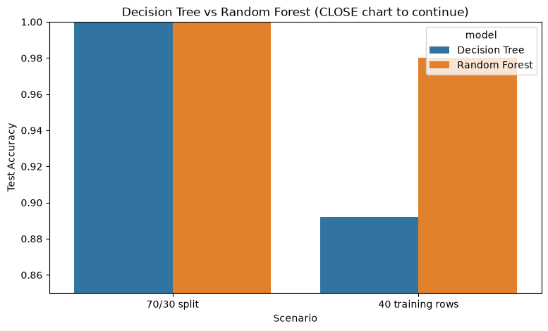
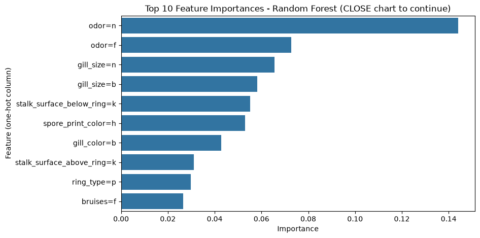

# Project Documentation

This site provides project documentation.
Use the documentation navigation to explore.

## How-To Guide

Many instructions are common to all our projects.

See
[⭐ **Workflow: Apply Example**](https://denisecase.github.io/pro-analytics-02/workflow-b-apply-example-project/)
to get the example projects running on your machine.

## Project Documentation Pages (docs/)

- **Home** - this documentation landing page
- [**Project Instructions**](./project-instructions.md)  - the standard project workflow
- [**Your Files**](./your-files.md) - how to copy the example and create your version
- [**Glossary**](./glossary.md) - project terms and concepts
- [**API**](./api.md) - autogenerated code documentation for the public project interface

## Phase 4. Technical Modification

**What I changed.** I copied the example `app_case.py` to `app_venkat_teja.py`
(leaving the example untouched) and converted it from regression to
classification. A new `derive_target()` step creates a categorical target,
`passed` ("pass" if `score >= 75`, else "fail"), a `DecisionTreeClassifier`
replaces `LinearRegression`, and the evaluation now reports accuracy, a
confusion matrix, and a classification report instead of MAE and R-squared.
The coefficient chart is replaced with a confusion matrix heatmap.

**Why I chose it.** This module is about classification, and the smallest
change that demonstrates its core skill is turning the example's continuous
target into a category and evaluating the classifier the way this module
teaches: confusion matrix, precision, recall, and F1.

**How I verified it.** I ran `uv run python -m mlstudio.app_venkat_teja` and
confirmed the log shows the derived target step, a 6 pass / 4 fail class
balance, the confusion matrix, and the classification report. I also ran
`ruff`, `pyright`, `pytest`, and the original `app_case` to confirm nothing
else broke.

**What confirmed the change.** The summary now reports the categorical target
(`passed`) with its class balance, and the log shows accuracy (0.67 on the 3
held-out rows) with a full per-class precision/recall/F1 report. The one miss
is instructive: the tree misclassified a borderline student (score 72, just
under the 75 threshold) as "pass" — a concrete illustration of why accuracy
alone can mislead on tiny, imbalanced test sets. The single-case prediction
changed from a numeric score (83.4) to a class label ("pass") — exactly the
behavior shift classification implies.

**Why it matters / difficulty.** Compared with the example, the model now
answers a categorical question ("will this student pass?") instead of
estimating a number, which requires different metrics and interpretation.
It was straightforward; the one gotcha was stratifying the train-test split —
with only 10 rows, an unstratified split can leave a class out of the test
set and make the metrics meaningless.

## Phase 5. Custom Project

My custom project classifies mushrooms as **edible or poisonous** and compares
two classifiers — a **Decision Tree** and a **Random Forest** — on the same
data, implemented in `src/mlstudio/app_mushrooms_venkat_teja.py`:

```shell
uv run python -m mlstudio.app_mushrooms_venkat_teja
```

### Basis and Data

The example project used the tiny synthetic `hours_scores_case.csv`
(10 students). For my custom project I chose the **UCI Mushroom dataset**
(`data/raw/mushrooms.csv`): 8,124 mushrooms from the Agaricus and Lepiota
families, 22 categorical features describing physical characteristics
(cap shape, odor, gill color, habitat, ...), and a nearly balanced target
(4,208 edible / 3,916 poisonous). Limitations: the data describes only two
mushroom families from a 1981 field guide, and `stalk_root` has 2,480 missing
values coded `?`, which I kept as their own "missing" category since an
unknown stalk root may itself carry signal. This dataset should never be
used to decide whether a real mushroom is safe to eat.

### Modeling Approach

This is **supervised classification**: every row has a known label
(edible/poisonous), and the target is a category, not a number. Tree-based
models are a natural fit because the features are all categorical and
tree splits ("does it have a foul odor?") mirror how a field guide reasons.
Comparing a single Decision Tree against a Random Forest (100 trees, each
trained on a bootstrap sample with random feature subsets) directly
exercises this module's theme: choosing a classifier based on evidence.

### Target

The example predicted a continuous score (regression). My target is the
binary `class` column mapped to readable labels (`p` → poisonous,
`e` → edible). A categorical target changes evaluation entirely: instead of
MAE/R-squared, I use accuracy, confusion matrices, and per-class
precision/recall — which matters here because the two error types are not
equal (calling a poisonous mushroom edible is far worse than the reverse).

### Features

The example used 5 numeric study-habit features. My 22 features are all
categorical letter codes, so I one-hot encoded them into 117 binary columns
(`odor=n`, `gill_size=b`, ...) since scikit-learn trees require numeric
input. I kept all 22 features and let the models rank them: the Random
Forest's feature importances put `odor` columns at the top, matching the
well-known result that odor alone nearly determines the class.

### Evaluation and Results

I evaluated both models with accuracy, confusion matrices, and
classification reports in two scenarios (all logged in `project.log`):

| Scenario | Decision Tree | Random Forest |
|---|---|---|
| Standard 70/30 split (5,686 train rows) | 1.0000 | 1.0000 |
| Scarce data (40 train rows, tested on 8,084) | 0.8921 | 0.9800 |

With plentiful data both models are perfect — the dataset is fully
separable, so the comparison is a tie. The scarce-data scenario is where
the ensemble earns its keep: averaging 100 diverse trees generalizes far
better from 40 examples than one tree can (0.98 vs 0.89). The most
interesting (and surprising) detail is in the confusion matrices: the
forest's higher accuracy comes almost entirely from fixing the tree's 752
false-poisonous errors, while on the *dangerous* error (poisonous predicted
edible) the tree was actually slightly better (120 vs 154). Accuracy alone
would hide that trade-off — exactly why this module teaches precision and
recall. Next improvement: tune the forest's decision threshold to push
poisonous recall toward 1.0 at the cost of some edible precision.





### Summary

I implemented a supervised classification module that loads the UCI Mushroom
dataset, one-hot encodes 22 categorical features, trains a Decision Tree and
a Random Forest on identical splits, and compares them with the evaluation
tools this module teaches. Both models are perfect with abundant data; with
scarce data the Random Forest wins on accuracy (0.98 vs 0.89) while the
confusion matrices reveal it slightly loses on poisonous recall — the metric
that matters most in this domain. I learned that "which model is better"
depends on the data budget *and* on which errors are costly, and that
per-class metrics are how you see it. These skills transfer directly to any
categorical decision problem: medical triage, loan approval, spam filtering,
or equipment fault detection.

**Decision Tree vs Random Forest, in short:** a Decision Tree is one set of
if/then rules — fast to train, easy to read, but high-variance: with little
data it memorizes noise and its accuracy drops. A Random Forest trains many
trees on random subsets of rows and features and lets them vote, trading
interpretability and speed for stability and better generalization. Use a
tree when you need an explainable model or a quick baseline; use a forest
when predictive performance matters and the data is limited or noisy.
